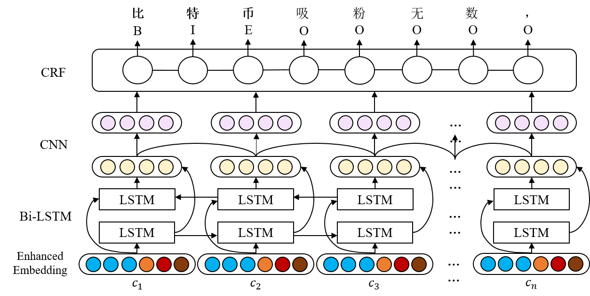
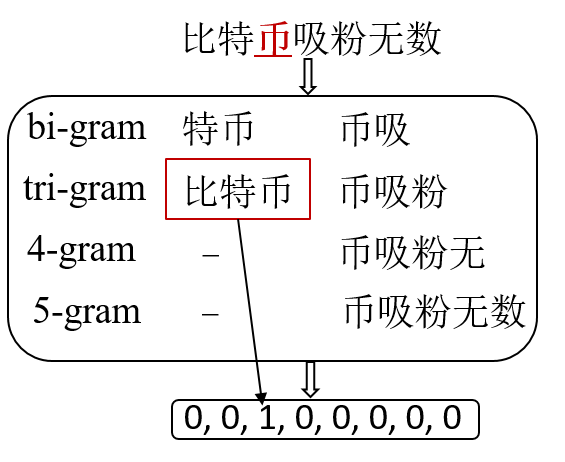
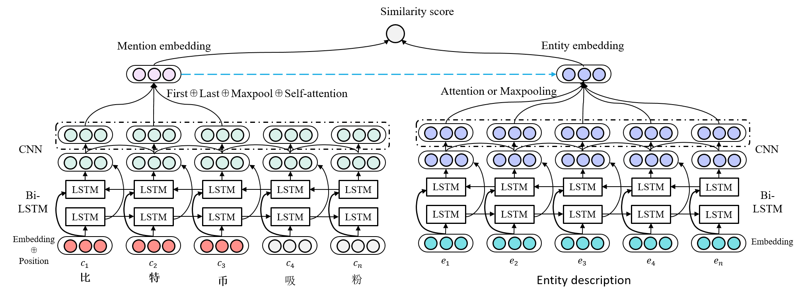
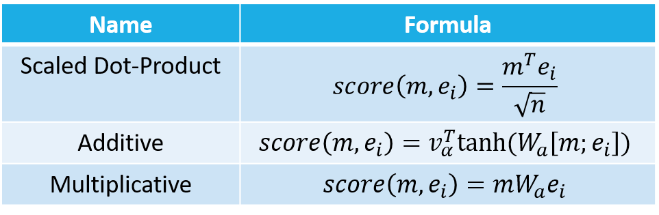
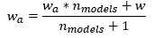

# Enhanced Character Embedding for Chinese Short Text Entity Linking

## 目录  
<!-- TOC -->
- [详细设计](#详细设计)
  - [整体设计思路](#整体设计思路)
  - [实体识别](#实体识别)
  - [实体消歧](#实体消歧)
  - [集成](#集成)
- [项目配置与运行](#项目配置与运行)
  - [数据准备](#数据准备)
  - [环境准备](#环境准备)
  - [训练](#训练)
  - [预测](#预测)
<!-- /TOC -->
  
## 详细设计  
### 整体设计思路
本次比赛我使用的是 pipeline 的方式解决实体链接问题，即先进行实体识别，而后进行实体消歧。由于中文缺少显式的词语分割符，基于词序列的实体链接容易受分词错误影响。但基于字序列的实体链接又无法充分利用句子中单词的语义信息。因此本次比赛的整体设计思路是在子序列输入的基础上，加入额外的信息来增强字的语义表达，即使用 enhanced character embedding 解决中文短文本实体链接问题。具体而言，对于实体识别，由于要求所识别的实体必须存在于知识库中的 mention 库，因此考虑加入 mention 库匹配信息；而对于实体消歧，在同一文本中出现的不同 mention 的 representation 应该不同，因此考虑加入 mention 的位置信息。

### 实体识别  

实体识别我采用经典的 BiLSTM+CNN+CRF 序列标注模型，输出使用 BIOES 标注。而在输入层上，我们除了使用字向量序列作为基础输入，还在此基础上拼接了一系列具有丰富语义信息，有助于识别实体 mention 边界的 embedding。拼接的 embedding 主要有：

- **c2v**  
使用word2vec的方法对训练语料的字序列进行训练，得到300维的字向量。这是实体识别模型的基础输入。  

- **bert***    
从在大规模语料上训练的预训练语言模型，如 [bert](https://github.com/google-research/bert)，[ernie](https://github.com/ArthurRizar/tensorflow_ernie)，[bert_wwm](https://github.com/ymcui/Chinese-BERT-wwm) 也可以得到768维的字向量。 

- **bic2v**    
邻接字bigram向量。将训练语料切成bigram字序列，如句子 `“比特币吸粉无数”` 会被切成序列：`['比特', '特币', '币吸', '吸粉', '粉无', '无数']`，然后使用word2vec的方法进行训练得到50维的邻接字bigram向量。  

- 间接引入mention库匹配信息的embedding    
我们将 `kb_data` 中所有的 alias 词典（即 mention 库）视为用户词典，导入至 jieba 后对文本进行分词，这样能最大程度保证 mention 作为一个完整的词被分割出来，然后我们加入以下embedding：  
  - **w2v@c**  
  字符所在词向量。分词得到训练语料的词序列后，我们先使用word2vec的方法进行训练，得到300维的词向量。然后我们为每个字都拼接上其所在的词的词向量，这样来自同一个 mention 的字都具有相同的词向量，有利于实体识别。
  
  - **cp**    
  字符所在词的位置特征向量。我们使用 BMES 标记字符在词中的位置。如句子 `“比特币吸粉无数”` 被 jieba 切成的词序列为：`['比特币', '吸粉', '无数']`，则字符的位置信息将会被标注为 `[B, M, E, B, E, B, E]`。我们为这四个标记分别随机初始化一个50维向量，然后在模型训练时再进行优化。
  
  - **cp2v**  
  位置感知的字符向量。将字序列与对应的位置标注序列结合起来，如上例的 `“比特币吸粉无数”` 将会得到序列：`['比B', '特M', '币E', '吸B', '粉E', '无B', '数E']`。我们使用word2vec的方法对这些加入了位置信息的字序列进行训练，得到位置感知的字符向量。可以看到，每个字加入了位置标注信息后，都会有4个不同的向量。    
  
- 直接引入mention库匹配信息的embedding
  - **ngram-match**  
  ngram匹配特征向量。我们将以每个字为首（尾）的 bi-gram， tri-gram， 4-gram 等与 mention 库进行匹配，得到 one-hot 向量。如下图例所示，考虑对“币”的 n-gram，发现只有以“币”为尾的 tri-gram “比特币”能够与 mention 库匹配。  
    
  
  - **max-match**  
  双向最大匹配特征向量。我们将 mention 库作为分词词典，使用双向最大匹配分词算法找出所有候选 mention。如句子 `“比特币吸粉无数”` 使用双向最大匹配算法后会得到分词序列：`['比特币', '吸粉', '无数']`，然后我们使用 BMEO 标注（'O'表示不是mention）将序列标注为`[B, M, E, B, E, B, E]`。我们为这四个标注分别随机初始化一个50维向量，然后在模型训练时再进行优化。

### 实体消歧
  
实体消歧使用语义匹配的思路，我们使用待消歧文本以及知识库中候选实体所有三元组拼接起来的实体描述文本作为匹配文本对，使用神经网络对它们进行建模得到各自的  representation，然后使用 cosine 相似度进行匹配度打分，选择得分最高的候选实体输出。神经网络框架大体是 BiLSTM+CNN，由于待消歧文本与候选实体描述文本的长度相差较大，我们没有使用孪生网络结构。下面重点介绍 mention embedding 和 entity embedding 如何生成。  

- mention embedding  
由于在同一文本中可能存在不同的mention，他们的 representation 也应该是不同的。如 `“唱歌的李娜和打网球的李娜是同一个人吗？”` 中的两个李娜就对应着不同的实体，对它们的建模也应该不一样。因此我们考虑加入 mention在文本的位置信息，主要有两种方法：
  1. 首先，我们在字向量序列输入的基础上，拼接上每个字与 mention 的相对位置向量，以反映他们与 mention 在距离上的紧密程度。相对位置向量一开始会被初始化成50维的向量，而后随着网络进行优化。
  2. 经过 BiLSTM+CNN 后，我们只选取 mention 部分的输出序列来产生 mention embedding。具体而言，我们将 mention 输出序列中第一个字向量、最后一个字向量、 maxpooling 向量以及使用 self-attention 得到的向量进行拼接，最后通过一层简单的全连接层得到 mention 表达。

- entity embedding  
得到 BiLSTM+CNN 输出的隐藏向量序列后，我们尝试了两种方法来得到 entity embedding：
  1. 对隐藏向量序列进行maxpooling，选择时间步上值最大的进行输出。
  2. 考虑 entity 描述文本每个字与 mention 的相似度，使用 mention embedding 与隐藏向量序列进行 attention 计算，而后使用隐藏向量的加权和结果作为 entity 表达。我们主要尝试了 3 种 attention 权重的计算方式:  
    

- 训练细节  
训练实体消歧模型时，我们采用的的损失函数是 L(m, e<sub>+</sub>, e<sub>-</sub>) = max(m+score(m, e<sub>-</sub>)-score(m, e<sub>+</sub>), 0)，其中 m 是 margin 的意思，即正确实体与 mention 的匹配得分要比错误实体的匹配得分至少高出一个 margin 的大小。实验里我们设置 margin 为 0.04。此外，我们会为每个正确实体采样 n 个错误实体（即负样本），实验中我们发现 n 取 4 或 5 最佳。

### 集成  
为了提分，我们还采用了两种模型集成的方式。

- weight averaging  
在训练单模型的时候，当模型训练了一定的 epochs 之后，模型逐渐接近（局部）最优点。这时候我们复制一份模型的权重 w<sub>a</sub> 在内存中。当新的一轮迭代结束之后，会产生一份新的模型权重 w，然后我们按照以下公式更新 w<sub>a</sub>：    从公式上我们可知，这种方法实际上便是对模型训练的最后几次迭代产生的模型进行参数上的平均。这种方式产生的模型更加“平滑”，总是要比训练得到的最好模型更优。

- output averaging  
我们还尝试了对不同模型的输出取平均的方法来进行集成。下面是关于实体识别与实体消歧的不同模型的设置：
  - 对于实体识别模型，我们对除了 **c2v** 外的输入 embedding 进行 ablation 实验发现它们对 performance 的贡献程度是为 **w2v@c** > **bert*** > **max_match** > **ngram_match** > **cp** > **bic2v** ≈ **cp2v**。因此考虑加或不加 **bic2v** 和 **cp2v** 向量，以及使用何种预训练语言模型（3种），我们可以产生在输入特征上有所不同的实体识别模型。
  - 对于实体消歧模型，考虑是否添加相对位置向量，是否使用CNN，以及 entity embedding 的产生方式，我们也可以得到在模型结构上不同的实体消歧模型。
  
## 项目配置与运行

### 数据准备
- [训练数据，提取码：ye3d](https://pan.baidu.com/s/1gNTcM-EUeSMwCTWoYfq6gQ)  
解压后，文件夹名为`ccks2019_el`，放至`raw_data`目录下。 

- [B榜测试数据，提取码：wb46](https://pan.baidu.com/s/1X_knNSLDgILCZW-AY1JeQg)  
下载后，文件名为`eval722.json`，放至`raw_data/ccks2019_el`目录下。

- [bert](https://storage.googleapis.com/bert_models/2018_11_03/chinese_L-12_H-768_A-12.zip)  
解压后，文件夹名为`chinese_L-12_H-768_A-12`, 放至`raw_data/embeddings`目录下。

- [ernie，提取码：iq74](https://pan.baidu.com/s/1I7kKVlZN6hl-sUbnvttJzA)  
解压后，文件夹名为`baidu_ernie`, 放至`raw_data/embeddings`目录下。

- [bert_wwm](https://drive.google.com/file/d/1RoTQsXp2hkQ1gSRVylRIJfQxJUgkfJMW/view)  
解压后，修改文件夹名为`chinese_wwm_L-12_H-768_A-12`，放至`raw_data/embeddings`目录下。

### 环境准备  
```python
pip install -r requirements.txt
```
### 训练

1. 预处理  
```python
python3 preprocess.py
```

2. 实体识别模型训练
```python
python3 train_er.py
```

3. 实体消歧模型训练
```python
python3 train_el.py
```

### 预测
```python
python3 ensemble.py
```
代码执行完毕后，会在`submit`目录生成`final_submit.json`。  

### 预处理文件与已训练模型下载
我也把预处理后生成的文件以及自己线下训练好的模型上传到了百度云。下载完毕后，把文件放在对应的目录下即可。预处理文件放在`data`目录，模型文件放在`ckpt`目录。

- [预处理文件，提取码：6oh6](https://pan.baidu.com/s/16A80R6hRX-NMZvRlhMpkmg)  
- [模型文件，提取码：nzn8](https://pan.baidu.com/s/12vnRITDMj_RKN_Ja0Ze14Q)

## FAQ

### 论文  
论文和海报在`paper`文件夹

### 实体识别模型的命名  
实体识别模型主要的区别在于输入的特征向量组合不同，以 `2step_er_c2v_fix_32_adam_0.001_BIOES_encoder_type_bilstm_cnn_use_crf_True_swa_ernie_layer_1_fix_bichar_bic2v_fix_word_w2v_fix_charpos_cpos2v_fix_softword_dictfeat_maxmatch_swa` 为例：

- **c2v_fix**：字符向量的预训练方法 (c2v, c_fastext, c_glove) 以及在模型训练过程中是否可以微调 (fix, tune)  
- **32**：batch_size
- **adam_0.001**：optimizer和学习率 
- **BIOES**：输出使用的标注方案(BIOES, BIO)  
- **encoder_type_bilstm_cnn**：基本的序列模型框架  
- **use_crf_True**：是否使用CRF层  
- **ernie_layer_1_fix**：使用何种bert模型产生bert embedding(bert, ernie, bert_wwm)，使用bert最后多少层作为输出(1)，是否可以微调(fix, tune) 
- **bichar_bic2v_fix**：邻接字向量的预训练方式(bic2x, bic_fasttext, bic_glove)以及在模型训练过程中是否可以微调(fix, tune)  
- **word_w2v_fix**：字符所在词向量的预训练方式(w2v, w_fasttext, w_glove)以及在模型训练过程中是否可以微调(fix, tune)  
- **charpos_cpos2v_fix**：位置感知的字符向量的预训练方式(cpos2v, cpos_fasttext, cpos_glove)以及在模型训练过程中是否可以微调(fix, tune)  
- **softword**：字符所在词的位置特征向量  
- **dictfeat**：ngram匹配特征向量  
- **maxmatch**：最大匹配特征向量  
- **swa**：采用权重平均集成策略  

### 实体消歧模型的命名  
实体消歧模型的区别主要在于如何产生 mention 表征和 entity 表征的方法不同：

1. `2step_el_c2v_fix_32_adam_0.001_rel_neg_5_not_omit_score_func_cosine_margin_0.04_max_mention_True_add_cnn_after_swa_swa.hdf5`  
    - **c2v_fix**：字符向量的预训练方法 (c2v, c_fastext, c_glove) 以及在模型训练过程中是否可以微调 (fix, tune)  
    - **32**：batch_size
    - **adam_0.001**：optimizer和学习率 
    - **rel**：产生mention表征的模型使用相对位置embedding输入  
    - **neg_5**：负样本个数(5)  
    - **not_omit**：不去掉只有一个候选实体的样本（无需消歧），默认会去掉  
    - **score_func_cosine**：使用何种相似度度量函数(cosine, dense(即mlp), polynomial, sigmoid, euclidean等)  
    - **margin_0.04**：损失函数中的margin的取值  
    - **max_mention_True**：使用隐藏状态序列产生 mention 表征的时候，除了对取来自 mention 部分序列的第一个和最后一个隐藏状态向量，还有对该部分序列使用self-attention的结果之外，是否对该部分序列使用max-pooling(max_mention_True)以及avg-pooling(avg_mention_True)  
    - **add_cnn_after**：是否在BiLSTM的基础上加上CNN，在BiLSTM前面(before)还是在后面加(after)  
    - **swa**：采用权重平均集成策略  
2. `2step_el_c2v_fix_32_adam_0.001_rel_neg_4_score_func_cosine_margin_0.04_max_mention_True_encoder_type_self_attend_single_attend_ent_attend_type_mul_swa_swa.hdf5`  
    - **encoder_type**：在`linking_model.py`尝试了多种使用隐藏状态序列产生 mention 表征和 entity 表征的方法：1. "self_attend_max" 表示 mention 表征使用来自 mention 部分序列的self-attention结果（还有第一个和最后一个隐藏状态向量，可能还有max-pooling和avg-pooling的结果），而 entity 表征使用 max-pooling的结果，这是默认的方法；2. "self_attend_single_attend" 表示 mention 表征使用来自 mention 部分序列的self-attention结果（还有第一个和最后一个隐藏状态向量，可能还有max-pooling和avg-pooling的结果）,而 entity 表征使用 mention 表征跟 entity 文本进行 attention 的结果，这时需要 "ent_attend_type" 指示使用哪种 attention 权重计算方式(mul, add, dot, scaled_dot)；3. "co_attend"：mention 表征 和 entity 表征使用两者的隐藏状态序列的interactive attention来产生。

